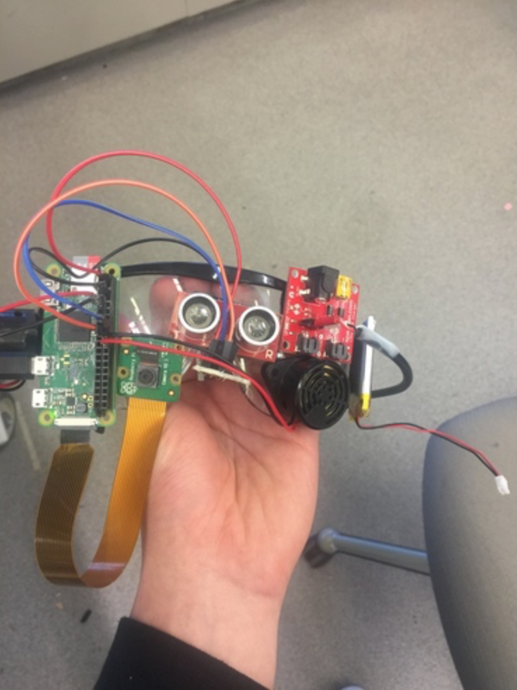

## Xwalk

# Introduction 
The inspiration for this project came from a [YouTube video](https://www.youtube.com/watch?v=48DqdwzftnQ) of a 
blind man crossing the street. In the video, the YouTuber states
that he relies on sound to cross the street and without the buzzing noise 
it is nearly impossible to cross the street. I tried to replicate that 
effect with Xwalk.

# What it does
Xwalk is a pair of glasses that help the blind cross the street. It has two primary functions: it helps the blind know when to walk by making a buzzing noise whenever there is a walk signal and it makes repetitive beeps when it sees someone else crossing the street so that he or she can assist the blind.

# How I built it
I needed to be able to see the surroundings so I chose to use the Raspberry Pi Zero W for its size and Wifi capabilities. For the walk signal recognition, I used OpenCV2 to train the recognizer. For the assistance part, I used the Google Vision API and ultrasensor to see if there is a person nearby to help

# Final Product 

 

